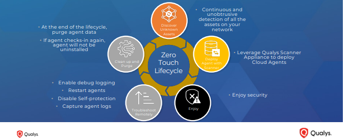

# 🥼 Lab 1 : Qualys Cloud Agent

Lab Objective 

* To understand Qualys cloud Agent, functions and characteristics&#x20;
* why do we need Qualys Agent&#x20;
* Qualys agent life cycle&#x20;
* Installation , configure and deployment of Qualys agent&#x20;
* Perform on demand scans&#x20;
* Identify asset details & Monitor Agent health using Dashboard&#x20;
* Purge rules to automate routine maintenance&#x20;
* Configuration topics Agent scan Merge, Agent Version control, CAPS, SwCA

## <mark style="color:yellow;">Qualys Cloud Agent</mark>&#x20;

The Qualys Cloud Agent is a lightweight, flexible agent designed to provide real-time visibility and response across your entire IT infrastructure

Features :&#x20;

* Real Time Data collection&#x20;
* Minimal Impact
* Comprehensive Security&#x20;
* Easy Deployment&#x20;
* Scalability&#x20;

The Cloud Agent is modular, and since it runs locally on the host, it offers additional functionality, such as patching, deploying scripts, file integrity monitoring, or threat response.

## <mark style="color:yellow;">Agent Lifecycle</mark>&#x20;

<figure><figcaption></figcaption></figure>

what is zero touch Agent lifecycle ?&#x20;

As per Qualys documentation , Qualys provides zeros touch agent lifecycle which means the lifecycle includes tools for troubleshooting the agents remotely, automating asset record deduplication, stale asset record cleanup and detecting unmanaged devices.&#x20;

## <mark style="color:yellow;">Deployment</mark>&#x20;

I'll be using my Kali Linux based computer for Qualys Agent installation .

**Agent to Platform Communication**&#x20;

* Agent hosts must be able to reach the cloud Agent Server URLs
* All communication is initiated by the Agent host outbound to Qualys&#x20;
* TCP port 443 use REST over HTTPS/TLS for communication&#x20;
* TLS 1.2,SHA-256,  & 2048 bit private key r used&#x20;
* Communications are encrypted using server certificates with application layer authentication, data security and non repudiation techniques
* compatible with stateful firewalls , Application firewalls, transparent and non transparent web proxies and NAT gateways&#x20;

